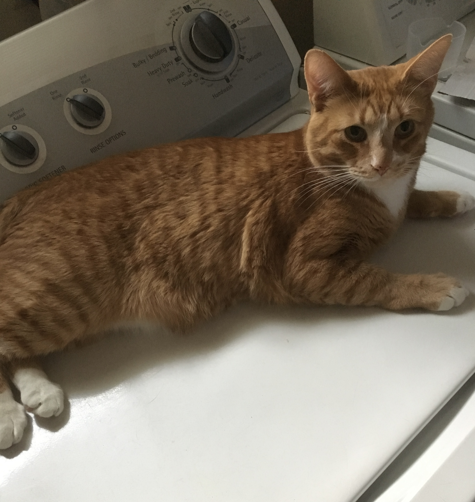

# Welcome to my website!

I'm glad you could make it. The purpose of this website is to showcase some of my projects and coursework I have completed at the University of Michigan, as well as highlight some of my intern and job experiences. I will also be doing reviews of some of the classes I took. The website is a work in progress, so please stay tuned :)

This website was made pretty effortlessly using MkDocs and largely inpired by Frederick Yin's website I stumbled upon when looking up reviews for EECS 311. A link to their website here: [fkfd.me](https://fkfd.me)

I'm not sure what else to say so here's a pictue of my cat on the washing machine:

